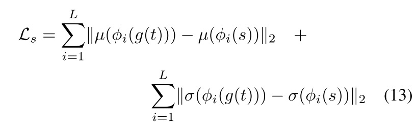

# Neural Style Transfer Papers

## Pioneering Works

### 1. [Image Style Transfer Using Convolutional Neural Networks](https://openaccess.thecvf.com/content_cvpr_2016/papers/Gatys_Image_Style_Transfer_CVPR_2016_paper.pdf)
>optimization based
  

### 2. [Perceptual Losses for Real-Time Style Transfer and Super-Resolution](https://arxiv.org/pdf/1603.08155.pdf)    
>single style transfer    

## Normalizations

### 1. [Instance Normalization: The Missing Ingredient for Fast Stylization](https://arxiv.org/pdf/1607.08022.pdf)
>single style transfer

### 2. [A Learned Representation For Artistic Style](https://arxiv.org/pdf/1610.07629.pdf)
>multi-style transfer

### 3. [Arbitrary Style Transfer in Real-time with Adaptive Instance Normalization](https://openaccess.thecvf.com/content_ICCV_2017/papers/Huang_Arbitrary_Style_Transfer_ICCV_2017_paper.pdf)
>arbitrary style transfer

>loss function

     
       
   

## Arbitrary Style Transfer

### 1. [Fast Patch-based Style Transfer of Arbitrary Style](https://arxiv.org/pdf/1612.04337.pdf?fbclid=IwAR2xiW2dBBmnARfERb4wcC2wmLIUC9puHrdgLVCKDj5wZO3dqTCnYTfKl6w)
>style swap             
>patch based         

 

### 2. [Arbitrary Style Transfer in Real-time with Adaptive Instance Normalization](https://openaccess.thecvf.com/content_ICCV_2017/papers/Huang_Arbitrary_Style_Transfer_ICCV_2017_paper.pdf)
>AdaIN           

>loss function       

     
       
  

### 3. [Universal Style Transfer via Feature Transforms](https://arxiv.org/pdf/1705.08086.pdf)
>WCT       

  

### 4. [Avatar-Net: Multi-scale Zero-shot Style Transfer by Feature Decoration](https://arxiv.org/pdf/1805.03857.pdf)
>Avatar Net         
>relating content image and style image by matrix multiplication

  

## Content Style Relating Techniques

### 1. [StyleBank: An Explicit Representation for Neural Image Style Transfer](https://openaccess.thecvf.com/content_cvpr_2017/papers/Chen_StyleBank_An_Explicit_CVPR_2017_paper.pdf)

>matrice multiplication

 

### 2. [Multi-style Generative Network for Real-time Transfer](https://openaccess.thecvf.com/content_ECCVW_2018/papers/11132/Zhang_Multi-style_Generative_Network_for_Real-time_Transfer_ECCVW_2018_paper.pdf)
>CoMatch layer

 

### 3. [Attention-aware Multi-stroke Style Transfer](https://openaccess.thecvf.com/content_CVPR_2019/papers/Yao_Attention-Aware_Multi-Stroke_Style_Transfer_CVPR_2019_paper.pdf)
> self-attention     
> filting for attentional features

 

### 4. [Arbitrary Style Transfer with Style-Attentional Networks](https://openaccess.thecvf.com/content_CVPR_2019/papers/Park_Arbitrary_Style_Transfer_With_Style-Attentional_Networks_CVPR_2019_paper.pdf)
> arbitrary styel transfer
> content-style attention

  

### 5. [Learning Linear Transformations for Fast Image and Video Style Transfer](https://openaccess.thecvf.com/content_CVPR_2019/papers/Li_Learning_Linear_Transformations_for_Fast_Image_and_Video_Style_Transfer_CVPR_2019_paper.pdf)
> linear transformation
> various techniques

### 6. [Style Transfer by Relaxed Optimal Transport and Self-Similarity](https://openaccess.thecvf.com/content_CVPR_2019/papers/Kolkin_Style_Transfer_by_Relaxed_Optimal_Transport_and_Self-Similarity_CVPR_2019_paper.pdf)

> cosine distance of hypercolumn (multiple grained information)(relate c s)   
> EMD loss    
> color loss, artifacts loss      
> user control     

## Not yet classified

### 1. [Combining Markov Random Fields and Convolutional Neural Networks for Image Synthesis](https://openaccess.thecvf.com/content_cvpr_2016/papers/Li_Combining_Markov_Random_CVPR_2016_paper.pdf)
>patch based
>swap similar patches

 

### 2. [Controlling Perceptual Factors in Neural Style Transfer](https://openaccess.thecvf.com/content_cvpr_2017/papers/Gatys_Controlling_Perceptual_Factors_CVPR_2017_paper.pdf)

 

### Arbitrary Style Transfer with Deep Feature Reshuffle

